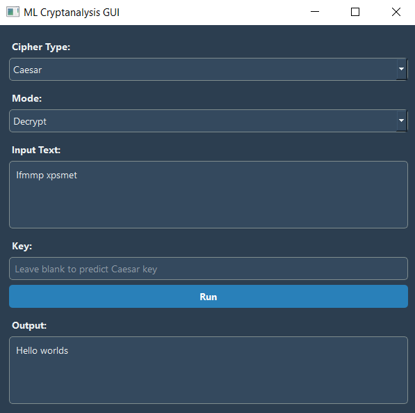

# 🔐 ML Cryptanalysis Toolkit

**ML Cryptanalysis Toolkit** is a Python-based GUI application that enables encryption, decryption, and machine learning-based key prediction for classical ciphers. Built with PyQt5 and scikit-learn, this tool is designed to help study cryptanalysis using AI.

---

## 🚀 Features

- 🔒 Encrypt & decrypt with 8 classical ciphers
- 🧠 Predict Caesar cipher keys using Random Forest
- 🧩 Supported ciphers:
  - Caesar
  - Vigenère
  - Substitution
  - Affine
  - Atbash
  - ROT13
  - Rail Fence
  - Autokey
- 🎨 PyQt5 GUI with dark mode
- 🧪 Dataset generator for model training

---
